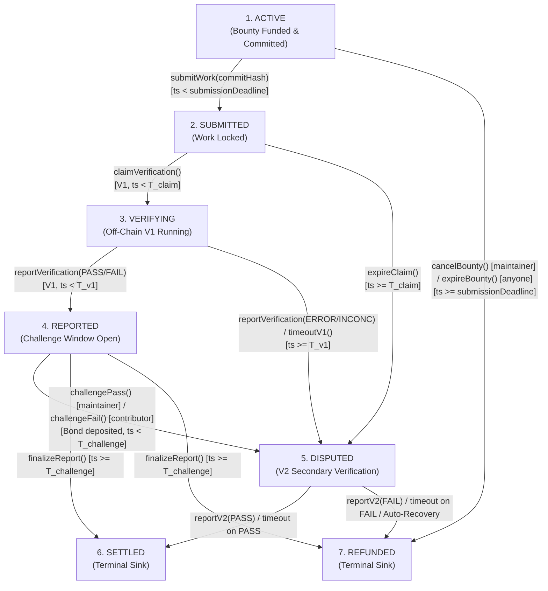

# TrustBounty

TrustBounty is a blockchain-based protocol for trust-minimized escrow and deterministic settlement of open-source software contribution bounties. It connects maintainer acceptance requirements with containerized off-chain verification oracles and non-blocking on-chain escrow.

---

## 1. Problem Statement

Open-source software bounties suffer from a fundamental trust asymmetry:
* **Maintainers** risk depositing funds into escrow only to have low-quality, non-compliant, or malicious code submitted, with no automated recourse.
* **Contributors** risk investing significant engineering effort only to face subjective rejections, non-responsive maintainers, or withheld payments on traditional centralized bounty platforms.
* **Centralized Platforms** rely on discretionary human arbitration, creating single points of failure, platform lock-in, and unpredictable dispute outcomes.

TrustBounty addresses this asymmetry by formalizing acceptance criteria into a machine-readable specification committed on-chain as an opaque hash before work begins, evaluating submitted Git commits inside containerized environments via off-chain verification oracles, and deterministically settling bounty escrow through a 7-state Directed Acyclic Graph (DAG) state machine.

> [!IMPORTANT]
> **Trust-Minimized Positioning**: TrustBounty v0.1 is an **escrow and oracle coordination protocol**, not a cryptographic proof of software correctness. The smart contract enforces custody, deadlines, state transitions, and pull-payment settlements by committing to off-chain oracle reports and test outcomes. The protocol provides permissionless progression to terminal states after the relevant deadlines, but this does not guarantee successful verification or contributor payment when verifier infrastructure fails.

---

## 2. High-Level Protocol Lifecycle

The protocol executes strictly across 7 discrete lifecycle states with acyclic progression and no retry loops:



1. **Specification & Funding**: A Maintainer authors a machine-readable acceptance specification (`BUILD`, `TEST`, `COVERAGE`) pinned to a container digest (`image@sha256:...`). Specification validation, RFC 8785 (JCS) canonicalization, and Keccak-256 hash computation are performed entirely off-chain. The maintainer calls `createBounty()`, depositing native ETH reward and committing the opaque `bytes32 specHash` (`ACTIVE`). The contract does not parse or canonicalize JSON.
2. **Work Submission**: A single Contributor submits an opaque Git commit SHA-1 (`commitHash`, `bytes20`) before `submissionDeadline` via `submitWork()` (`SUBMITTED`). The contract validates only that `commitHash != bytes20(0)` and stores the identifier. The contract does not verify repository membership, Git object validity, tree contents, or commit ancestry. Off-chain verifier infrastructure is responsible for fetching and checking out the commit.
3. **Primary Verification (V1)**: The protocol-configured `PRIMARY_VERIFIER` claims the submission within `T_claim` (`VERIFYING`) and executes test criteria in an off-chain container. Verifiers are authorized on-chain solely via fixed deployment-level addresses (`msg.sender == PRIMARY_VERIFIER`); the contract performs no signature verification or `ecrecover`. V1 reports `PASS`/`FAIL` (`REPORTED`) or `ERROR`/`INCONCLUSIVE` (escalating to `DISPUTED`) alongside an opaque `evidenceHash`. `reportVerification()` does not accept a second commit hash for an on-chain equality check.
4. **Symmetric Challenge Window**: The aggrieved party can post a protocol-bounded challenge bond ($B_{chal} = \min(\text{reward}, \text{MAX\_BOND\_CAP})$) within `T_challenge` (`challengePass()` for maintainers, `challengeFail()` for contributors), escalating to `DISPUTED`. If unchallenged, `finalizeReport()` deterministically resolves to `SETTLED` (for PASS) or `REFUNDED` (for FAIL).
5. **Secondary Verification (V2) & Recovery**: The `SECONDARY_VERIFIER` (authorized via `msg.sender == SECONDARY_VERIFIER`) resolves disputes via `reportV2()` with a binary `PASS` (→ `SETTLED`) or `FAIL` (→ `REFUNDED`). If V2 fails to report before `T_v2`, `finalizeV2Timeout()` executes deterministic fallback resolution based on dispute origin.
6. **Pull-Payment Withdrawal**: Terminal states extinguish bounty liabilities and credit `withdrawableBalance[recipient]`. Recipients pull their credited funds on demand via `withdraw()` or route them to a designated target via `withdrawTo(destination)`.

---

## 3. System Architecture (5-Tier Model)

TrustBounty architecture is organized across five distinct tiers, separating on-chain enforcement from off-chain processing:

* **Tier 1: On-Chain Escrow & State Machine [IMPLEMENTED NOW]**: The monolithic, non-upgradeable Solidity contract (`TrustBounty.sol`, `ITrustBounty.sol`, `TrustBountyTypes.sol`) holding escrowed ETH, enforcing the 7-state DAG, tracking segregated liabilities, and executing pull payments.
* **Tier 2: Opaque Commitment Anchors & On-Chain Interface [IMPLEMENTED NOW]**: On-chain storage of opaque cryptographic anchors (`specHash`, `commitHash`, `evidenceHash`) and immutable role bindings (`PRIMARY_VERIFIER`, `SECONDARY_VERIFIER`).
* **Tier 3: Off-Chain Acceptance Specification Processing [PLANNED / PHASE 2]**: Tooling for Schema v1.1 validation, RFC 8785 (JCS) canonicalization, and off-chain `specHash` generation.
* **Tier 4: Off-Chain Verifier & Execution Infrastructure [PLANNED / PHASE 2]**: Autonomous V1/V2 daemon services, Docker execution sandbox, evidence bundle generator, and Anvil integration harness.
* **Tier 5: External Infrastructure & Dependencies**: Git repositories (GitHub/GitLab), OCI container registries, and EVM network nodes.

---

## 4. Implementation Status

| Component | Tier | Status | Description |
| :--- | :---: | :---: | :--- |
| **`TrustBounty.sol`** | Tier 1 | **Implemented & Frozen** | Complete 7-state DAG, all 15 external functions implemented, segregated liability accounting, pull-payment withdrawals. |
| **`ITrustBounty.sol` & Types** | Tier 1 & 2 | **Implemented & Frozen** | Canonical interface, 13 events, 16 custom errors, and data structures. |
| **Foundry Test Suite** | Testing | **Implemented** | 256 passing tests in `TrustBounty.t.sol` providing extensive deterministic, fuzzed, invariant, adversarial, and bounded stateful coverage. |
| **Acceptance Spec Engine** | Tier 3 | *Planned / Phase 2* | RFC 8785 / JCS canonicalization, Schema v1.1 validation, and off-chain spec hashing tools. |
| **Verification Daemons (V1/V2)**| Tier 4 | *Planned / Phase 2* | Autonomous off-chain oracle daemons, container execution sandbox, and evidence generator. |
| **Evidence Bundle Generation** | Tier 4 | *Planned / Phase 2* | Off-chain transcript collector and evidence hashing pipeline. |
| **Anvil Integration Harness** | Tier 4 | *Planned / Phase 2* | End-to-end integration testbed connecting oracles to local Anvil node. |

---

## 5. Accounting, Solvency & Surplus Semantics

* **Solvency Invariant**: The contract satisfies the accounting invariant:
  $$\text{address}(\text{this}).\text{balance} \ge \text{totalRewardLiability} + \text{totalBondLiability} + \text{totalWithdrawableLiability}$$
  This is an accounting/solvency invariant maintained by the contract implementation and validated by the test suite; it is not an on-chain runtime assertion executed after each operation.
* **Forced ETH Surplus**: Any ETH forcibly transferred to the contract (e.g. via `selfdestruct` or mining coinbase) increases `address(this).balance` without increasing internal liability counters. Version 0.1 contains no sweep or recovery mechanism; such surplus therefore remains permanently unallocated and trapped in the contract without compromising solvency or accounting for legitimate credits.
* **Container Reproducibility**: Container environments are referenced by SHA-256 image digest (`image@sha256:...`). The digest cryptographically binds the image filesystem contents; however, host kernel, hardware architecture, CPU scheduling, network access, and external dependencies can still introduce runtime variability.

---

## 6. Repository Structure

```text
TrustBounty/
├── contracts/               # Solidity smart contracts & Foundry test suite
│   ├── src/                 # TrustBounty.sol, ITrustBounty.sol, TrustBountyTypes.sol
│   ├── test/                # TrustBounty.t.sol (Foundry unit & structural tests)
│   ├── foundry.toml         # Foundry configuration (Solc 0.8.37, Cancun, optimizer)
│   └── remappings.txt       # Canonical Foundry dependency remappings
├── specification/           # Acceptance specification engine (TypeScript)
│   ├── src/                 # Validation, RFC 8785 JCS canonicalization, hashing
│   └── test/                # Unit tests for specification canonicalization
├── docs/                    # Canonical protocol & architecture documentation
│   ├── CONTRACT_SPEC.md     # Normative on-chain contract specification (Source of Truth)
│   ├── ARCHITECTURE.md      # Protocol architecture, components, and data flow
│   ├── THREAT_MODEL.md      # Security properties, threat analysis, and trust assumptions
│   ├── VERIFICATION_SPEC.md # Off-chain verification engine & criteria specification
│   ├── TESTING.md           # Testing strategy, invariant suites, and test execution
│   ├── RESEARCH.md          # Research positioning, hypotheses, and evaluation metrics
│   ├── DECISIONS.md         # Architectural Decision Records (ADRs)
│   └── README.md            # Documentation index & normative precedence rules
├── backend/                 # Backend indexing & API services (Planned)
├── frontend/                # React / TypeScript user interface (Planned)
├── verifier/                # Off-chain container verification daemon (Planned)
├── storage/                 # Evidence storage adapters (Planned)
├── experiments/             # Benchmark testbeds & evaluation scripts (Planned)
└── scripts/                 # Deployment and utility scripts
```

---

## 7. Tech Stack

* **Smart Contracts**: Solidity `0.8.37`, Foundry toolchain (`forge`, `cast`), OpenZeppelin Contracts `v5.6.1` (`ReentrancyGuard`), EVM Cancun target.
* **Specification Engine**: Node.js, TypeScript, RFC 8785 Canonicalize, `js-sha3` (Keccak-256).
* **Verification Runtime**: Docker / OCI container runtime, isolated process sandboxing.
* **Escrow Asset**: Native ETH exclusively.

---

## 8. Local Setup & Testing

### Prerequisites
* [Foundry](https://book.getfoundry.sh/) (`forge`, `cast`)
* [Node.js](https://nodejs.org/) (v18+ or v20+) and `npm`

### 1. Build & Test Smart Contracts
```bash
cd contracts
forge build
forge test
```

### 2. Build & Test Specification Engine
```bash
cd specification
npm install
npm test
```

---

## 9. Canonical Documentation References

* **[Normative Contract Specification](docs/CONTRACT_SPEC.md)** — Authoritative on-chain specification, state machine, errors, events, and accounting.
* **[System Architecture](docs/ARCHITECTURE.md)** — Architectural components, data flows, and trust boundaries.
* **[Threat Model & Security](docs/THREAT_MODEL.md)** — Threat vectors, mitigations, and residual trust assumptions.
* **[Verification Specification](docs/VERIFICATION_SPEC.md)** — Off-chain container execution and evidence hash contract.
* **[Testing Strategy](docs/TESTING.md)** — Unit, invariant, and fuzz testing matrix.
* **[Research Framing](docs/RESEARCH.md)** — Research questions, evaluation metrics, and benchmarking.
* **[Architectural Decisions (ADRs)](docs/DECISIONS.md)** — Design decisions and rationale.
* **[Documentation Index](docs/README.md)** — Complete documentation directory and precedence rules.
