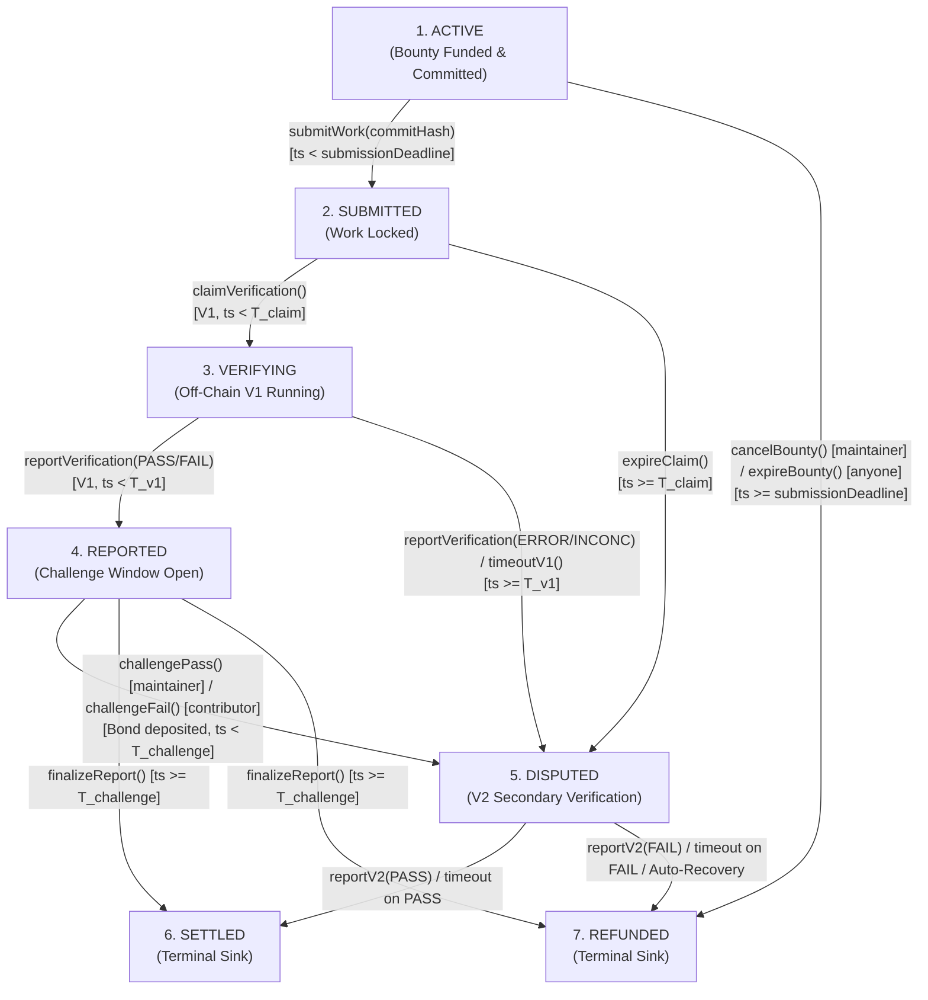

# TrustBounty

TrustBounty is a blockchain-based protocol for trust-minimized escrow and deterministic settlement of open-source software contribution bounties. It connects maintainer acceptance requirements with containerized off-chain verification oracles and non-blocking on-chain escrow.

---

## 1. Problem Statement

Open-source software bounties suffer from a fundamental trust asymmetry:
* **Maintainers** risk depositing funds into escrow only to have low-quality, non-compliant, or malicious code submitted, with no automated recourse.
* **Contributors** risk investing significant engineering effort only to face subjective rejections, non-responsive maintainers, or withheld payments on traditional centralized bounty platforms.
* **Centralized Platforms** rely on discretionary human arbitration, creating single points of failure, platform lock-in, and unpredictable dispute outcomes.

TrustBounty addresses this asymmetry by formalizing acceptance criteria into an immutable, machine-readable specification committed on-chain *before* work begins, evaluating submitted Git commits inside pinned containerized environments via dual verification oracles, and deterministically settling bounty escrow through a 7-state Directed Acyclic Graph (DAG) state machine.

> [!IMPORTANT]
> **Trust-Minimized Positioning**: TrustBounty v0.1 is a **trust-minimized oracle coordination protocol**, not a cryptographic proof of software correctness. The smart contract enforces custody, deadlines, state transitions, and pull-payment settlements by committing to off-chain oracle reports and containerized test outcomes.

---

## 2. High-Level Protocol Lifecycle

The protocol executes strictly across 7 discrete lifecycle states with guaranteed acyclic progression and no retry loops:



1. **Specification & Funding**: A Maintainer authors a machine-readable acceptance specification (`BUILD`, `TEST`, `COVERAGE`) pinned to an immutable container digest (`image@sha256:...`), computes its Keccak-256 commitment (`specHash`), and calls `createBounty()` depositing native ETH reward (`ACTIVE`).
2. **Work Submission**: A single Contributor submits an exact Git commit SHA-1 (`commitHash`, `bytes20`) before `submissionDeadline` via `submitWork()` (`SUBMITTED`).
3. **Primary Verification (V1)**: The protocol-configured `PRIMARY_VERIFIER` claims the submission within `T_claim` (`VERIFYING`) and executes the test criteria inside the container environment. V1 reports `PASS`/`FAIL` (`REPORTED`) or `ERROR`/`INCONCLUSIVE` (escalating to `DISPUTED`).
4. **Symmetric Challenge Window**: The aggrieved party can post a protocol-bounded challenge bond ($B_{chal} = \min(\text{reward}, \text{MAX\_BOND\_CAP})$) within `T_challenge` (`challengePass()` for maintainers, `challengeFail()` for contributors), escalating to `DISPUTED`. If unchallenged, `finalizeReport()` deterministically resolves to `SETTLED` (for PASS) or `REFUNDED` (for FAIL).
5. **Secondary Verification (V2) & Recovery**: The `SECONDARY_VERIFIER` resolves disputes via `reportV2()` with a binary `PASS` (→ `SETTLED`) or `FAIL` (→ `REFUNDED`). If V2 fails to report before `T_v2`, `finalizeV2Timeout()` executes deterministic fallback resolution based on dispute origin.
6. **Pull-Payment Withdrawal**: Terminal states extinguish bounty liabilities and credit `withdrawableBalance[recipient]`. Recipients pull their credited funds on demand via `withdraw()` or route them to a designated target via `withdrawTo(destination)`.

---

## 3. Architecture Summary

TrustBounty combines four core subsystems:
* **Escrow Smart Contract (`contracts/`)**: A monolithic, non-upgradeable Solidity contract holding escrowed ETH, enforcing state transitions and timeouts, tracking internal liability accounting, and facilitating pull-payment withdrawals.
* **Acceptance Specification Module (`specification/`)**: A TypeScript library validating schema v1.1 criteria, applying RFC 8785 JSON Canonicalization Scheme (JCS), and producing deterministic `specHash` commitments.
* **Verification Oracles (`verifier/`)**: Configured off-chain oracle accounts (`PRIMARY_VERIFIER` and `SECONDARY_VERIFIER`) that fetch repositories, check out exact commit hashes, execute criteria inside isolated Docker containers, and submit on-chain verification reports with `evidenceHash` commitments.
* **Evidence & Storage Subsystem (`storage/`)**: Off-chain storage of execution logs and test artifacts tied to the on-chain `evidenceHash`.

---

## 4. Current Implementation Status

| Component | Status | Description |
| :--- | :--- | :--- |
| **Acceptance Specification Module** | **Complete** | Schema v1.1, JCS RFC 8785 canonicalization, Keccak-256 `specHash` computation fully implemented in TypeScript with unit test suite. |
| **Smart Contract Core Skeleton** | **Implemented** | `TrustBountyTypes.sol`, `ITrustBounty.sol`, storage layout, constructor validations, and error definitions frozen. |
| **`createBounty()`** | **Implemented** | Escrow deposit, parameter validation, liability increment, and `BountyCreated` event fully tested. |
| **`submitWork()`** | **Implemented** | Contributor locking, `bytes20` commit hash storage, claim deadline computation, and `WorkSubmitted` event fully tested. |
| **Later Lifecycle Functions** | *Specification Frozen* | `cancelBounty`, `expireBounty`, `claimVerification`, `expireClaim`, `reportVerification`, `timeoutV1`, `challengePass`, `challengeFail`, `finalizeReport`, `reportV2`, `finalizeV2Timeout`, `withdraw`, `withdrawTo` defined in `ITrustBounty.sol` and specified in `CONTRACT_SPEC.md` (currently stubbed). |
| **Verification Oracle Service** | *In Progress* | Container runner, execution sandbox, and evidence generator architecture specified. |
| **Backend & Frontend** | *Planned* | Indexer services and maintainer/contributor UI planned for milestone phases. |

---

## 5. Repository Structure

```text
TrustBounty/
├── contracts/               # Solidity smart contracts & Foundry test suite
│   ├── src/                 # TrustBounty.sol, ITrustBounty.sol, TrustBountyTypes.sol
│   ├── test/                # TrustBounty.t.sol (Foundry unit & structural tests)
│   ├── foundry.toml         # Foundry configuration (Solc 0.8.37, Cancun, optimizer)
│   └── remappings.txt       # Canonical Foundry dependency remappings
├── specification/           # Acceptance specification engine (TypeScript)
│   ├── src/                 # Validation, RFC 8785 JCS canonicalization, hashing
│   └── test/                # Unit tests for specification canonicalization
├── docs/                    # Canonical protocol & architecture documentation
│   ├── CONTRACT_SPEC.md     # Normative on-chain contract specification (Source of Truth)
│   ├── ARCHITECTURE.md      # Protocol architecture, components, and data flow
│   ├── THREAT_MODEL.md      # Security properties, threat analysis, and trust assumptions
│   ├── VERIFICATION_SPEC.md # Off-chain verification engine & criteria specification
│   ├── TESTING.md           # Testing strategy, invariant suites, and test execution
│   ├── RESEARCH.md          # Research positioning, hypotheses, and evaluation metrics
│   ├── DECISIONS.md         # Architectural Decision Records (ADRs)
│   └── README.md            # Documentation index & normative precedence rules
├── backend/                 # Backend indexing & API services (Planned)
├── frontend/                # React / TypeScript user interface (Planned)
├── verifier/                # Off-chain container verification daemon (Planned)
├── storage/                 # Evidence storage adapters (Planned)
├── experiments/             # Benchmark testbeds & evaluation scripts (Planned)
└── scripts/                 # Deployment and utility scripts
```

---

## 6. Tech Stack

* **Smart Contracts**: Solidity `0.8.37`, Foundry toolchain (`forge`, `cast`), OpenZeppelin Contracts `v5.6.1` (`ReentrancyGuard`), EVM Cancun target.
* **Specification Engine**: Node.js, TypeScript, RFC 8785 Canonicalize, `js-sha3` (Keccak-256).
* **Verification Runtime**: Docker / OCI container runtime, isolated process sandboxing.
* **Escrow Asset**: Native ETH exclusively.

---

## 7. Local Setup & Testing

### Prerequisites
* [Foundry](https://book.getfoundry.sh/) (`forge`, `cast`)
* [Node.js](https://nodejs.org/) (v18+ or v20+) and `npm`

### 1. Build & Test Smart Contracts
```bash
cd contracts
forge build
forge test
```

### 2. Build & Test Specification Engine
```bash
cd specification
npm install
npm test
```

---

## 8. Canonical Documentation References

* **[Normative Contract Specification](docs/CONTRACT_SPEC.md)** — Authoritative on-chain specification, state machine, errors, events, and accounting.
* **[System Architecture](docs/ARCHITECTURE.md)** — Architectural components, data flows, and trust boundaries.
* **[Threat Model & Security](docs/THREAT_MODEL.md)** — Threat vectors, mitigations, and residual trust assumptions.
* **[Verification Specification](docs/VERIFICATION_SPEC.md)** — Off-chain container execution and evidence hash contract.
* **[Testing Strategy](docs/TESTING.md)** — Unit, invariant, and fuzz testing matrix.
* **[Research Framing](docs/RESEARCH.md)** — Research questions, evaluation metrics, and benchmarking.
* **[Architectural Decisions (ADRs)](docs/DECISIONS.md)** — Design decisions and rationale.
* **[Documentation Index](docs/README.md)** — Complete documentation directory and precedence rules.
